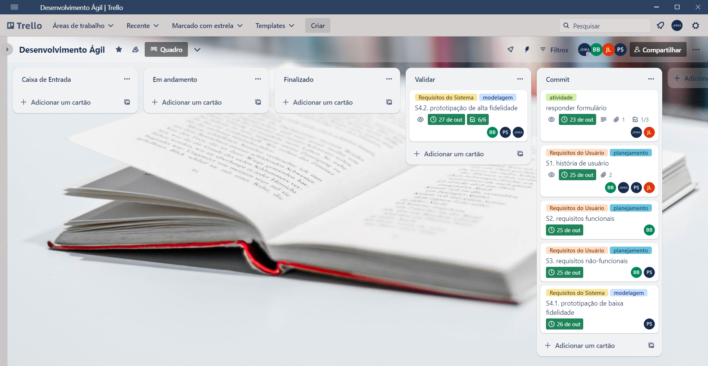

  

## Sobre o projeto
O projeto tem como objetivo auxiliar a comunicação entre leitor e editora de livros. Nosso site possui um formulário, para que os leitores possam escrever suas dúvidas e reclamações para as editoras de seus livros favoritos, essas respostas ao formulário serão enviadas para o e-mail das editoras para que elas possam fazer melhorias.
Além disso, nosso projeto possui um banco de dados para que todas as reclamações dos usuários sejam armazenadas para futura visualização, caso desejarem. Para que isso seja possível o leitor deve criar uma conta em nosso sistema.

## Desenvolvimento
Projeto desenvolvido durante as aulas de Desenvolvimento Ágil (EC46C) no segundo semestre de 2023 com a professora Erica Ferreira de Souza. Para o desenvolvimento foi utilizado o Trello para a organização e gestão das atividades do projeto, assim como o Figma para a prototipação de Alta Fidelidade.

### Trello

 

### Configuração do Figma
Para a visualização do projeto é aconselhável que clique no ícone de Present, que se encontra na parte superior à direita da tela, ou dê um ctrl + alt + enter no seu teclado, após o mockup ser carregado, para selecionar a tela cheia escolha a opção “fit width” em Options.
  
## Integrantes

* __Bruno Garcia Baricelo__

    Link para contato: [conta github](https://github.com/Gnordh1)

* __Caio Augusto Rolim dos Santos Umeda__

    Link para contato: [conta github](https://github.com/CaioUmeda)
  
* __Jean Marcelo Nogueira Paes Leme__

  Link para contato: [conta github](https://github.com/JeanMNP)

* __Jéssica Leme Freitas__

  Link para contato: [conta github](https://github.com/jekkaleeme)
  
* __Leonardo Canuto Junior__

  Link para contato: [conta github](https://github.com/leonardocjr)
  
* __Pedro Coppo Silva__

    Link para contato: [conta github](https://github.com/Pedrada66)